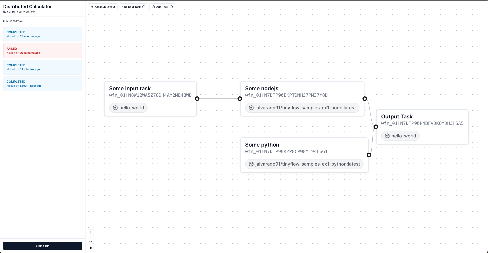

# TinyFlow 

TinyFlow is a tiny distributed workflow implementation built on top of [Railway's](https://railway.app/) API. It lets you create a DAG of tasks which can only start once all dependecies have completed successfully. 

Tasks are simply containers that run a process and exit when completed successfully. 



### Deploying

You'll need a railway project, a railway API token, the public URL of the project, and some tasks you'd like to run. 
In your railway project you'll need a MongoDb service running. That's the only dependency. Give your service an external URL and go through the onboarding details.

TinyFlow can live in the same project where the resources will be deployed to, or it can reference a different project. At this time, a TinyFlow deployment only supports one project, so I recommend putting in in the same railway project where the resources will be.

You can also try my instance at https://tinyflow.up.railway.app (if I haven't shut it down)

### Local Usage
The steps are similar as above. You'll need a MongoDB URL string, and you'll need something like ngrok to listen to webhook notifications from railway. Check the `.env.example` file for the variable names. 

Then you can run 

```
npm run dev
```

### About Tasks
I have setup some task containers, built with Nixpacks as seen in the sample above. 

You can find the source and image pages bellow

- https://github.com/jalvarado91/tinyflow-samples/
- https://hub.docker.com/repository/docker/jalvarado91/tinyflow-samples-ex1-python
- https://hub.docker.com/repository/docker/jalvarado91/tinyflow-samples-ex1-node
